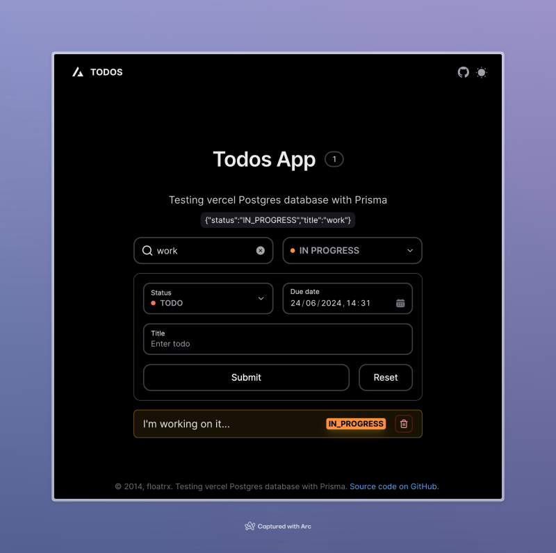

# TODO app with Next.js, Prisma ORM and VercelPostgres



Demo: [https://floatrx-next-prisma-postgres.vercel.app/](https://floatrx-next-prisma-postgres.vercel.app/)

This is a simple test project to demonstrate how to use Next.js with NextUI, Prisma ORM and VercelPostgres DB.

It includes a simple project structure with separated features (not FSD).

The project also includes a simple form to add new items to the list.

## Technologies Used

- [Next.js 14](https://nextjs.org/docs/getting-started)
- [NextUI v2](https://nextui.org/)
- [Tailwind CSS](https://tailwindcss.com/)
- [Tailwind Variants](https://tailwind-variants.org)
- [TypeScript](https://www.typescriptlang.org/)
- [Framer Motion](https://www.framer.com/motion/)
- [next-themes](https://github.com/pacocoursey/next-themes)
- [Prisma](https://www.prisma.io/)
- [VercelPostgres](https://vercel.com/docs/storage/vercel-postgres)

### Install dependencies

You can use one of them `npm`, `yarn`, `pnpm`, `bun`, Example using `bun`:

```bash
bun install # or `bun i`
```

### Run the development server

```bash
bun run dev # or `bun dev`
```
